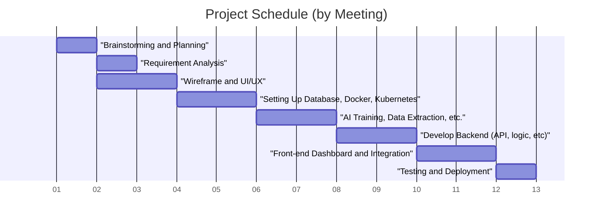

# AtmoGuard

This repository is created for DTETI UGM's Information Engineering Senior Project 2026/2027

## About Us

Nama Kelompok: **Dua Empat**  

Anggota:  
Debert Jamie Chanderson (24/540062/TK/59896)  
Muhammad Falah Aufa Anggara (24/540500/TK/59995)  
Harum Satiti Astyanti (24/543492/TK/60398)  

Instansi: **Departemen Teknik Elektro dan Teknologi Informasi, Fakultas Teknik, Universitas Gadjah Mada**  

## About AtmoGuard

Product Name: AtmoGuard  
Product Type: Web Application  

Background:  
Air quality in urban areas is often the main trigger for spikes in cases of acute respiratory infections (ARI). Several cities in Indonesia, such as Jakarta and Tangerang, have recorded air quality indices (AQI) that fall into the “unhealthy” category. The worsening air pollution is caused by exhaust emissions from motor vehicles, which continue to rise as the number of vehicles increases, as well as by the forest fires that occur every year. This year, forest and land fires have once again occurred in several regions, such as Sumatra and Kalimantan, with the area of land burned reaching more than 72,000 hectares. Forest and land fires not only cause damage to nature and the habitats of animals and plants, but also impact air quality in nearby cities. According to IQAir data from August 2026, three cities have already entered the “Dangerous” category: Palangkaraya (526), Pekanbaru (460), and Pontianak (417).   
Vulnerable individuals, such as pregnant women, toddlers, the elderly, and people with lung diseases, are the groups most at risk of exposure to air pollution. Efforts to improve air quality must be intensified to protect everyone from the risk of respiratory diseases such as asthma, bronchitis, and chronic obstructive pulmonary disease (COPD). In addition, individuals in vulnerable groups need a warning system to protect themselves and raise awareness about their surroundings.  

Problem Statement:  
1. How can we build a regression or classification prediction model based on historical weather data to forecast daily AQI with a target accuracy of over 80%?
2. How can we design a secure and scalable cloud infrastructure to process AI inference results while managing users’ personal health logs?
3. How can we design a network architecture capable of periodically aggregating data from external weather sensors without overloading the bandwidth or causing high latency?

Solution Idea:  
1. Build a Multiple Linear Regression algorithm using the Python ecosystem (such as PyTorch, Pandas, and NumPy). The model will be trained on a local atmospheric dataset to identify patterns and predict AQI values for the next 24 hours.
2. Utilize cloud database services to store spatial data schemas, alert histories, and user profiles. System access management is secured through cloud authentication services (such as Clerk).
3. Implementing a backend API, where the server will retrieve weather parameter data, process it through an AI model, and deliver the results to the web client. Redis will be used as a server-side caching layer to prevent network bottlenecks when prediction traffic peaks.

Competitor Analysis:  
1. Competitor 1

| **COMPETITOR 1** | |
| :--- | :--- |
| **Name** | Nafas Indonesia |
| **Competitor Type** | Direct Competitor |
| **Product Type** | Mobile Application, B2B Enterprise Solution |
| **Customer Target** | People in urban areas of Indonesia, commercial facilities |

| **Pros** | **Cons** |
| :--- | :--- |
| - Has many physical sensor locations spread across the Jabodetabek area - Rapid response recommendation feature | - Does not yet include a feature for entering medical records - The application focuses only on passive data reporting - Depends on physical hardware expansion |

| **Key Competitive Advantage and Unique Value** |
| :--- |
| Real-time, hyper-local air quality data specific to Indonesia from a network of independent sensors |

2. Competitor 2

| **COMPETITOR 2** | |
| :--- | :--- |
| **Name** | IQAir |
| **Competitor Type** | Tertiary Competitor |
| **Product Type** | AirVisual global app dashboard, IoT monitoring tool for the home |
| **Customer Target** | Governments, corporate entities, high-end consumers |

| **Pros** | **Cons** |
| :--- | :--- |
| - IoT sensor hardware integration - End-to-end ecosystem (from monitors to air purifiers) | - High cost - Too broad/generalist an approach for specific health interventions |

| **Key Competitive Advantage and Unique Value** |
| :--- |
| Industry leader with the capability to cross-validate data from tens of thousands of government- and community-owned stations worldwide  |

3. Competitor 3

| **COMPETITOR 3** | |
| :--- | :--- |
| **Name** | Plume Labs |
| **Competitor Type** | Indirect Competitor |
| **Product Type** | Portable sensors & air quality maps |
| **Customer Target** | Active commuters and outdoor enthusiasts in major cities around the world |

| **Pros** | **Cons** |
| :--- | :--- |
| - Mature and reliable technology - Large-scale data - Long-term forecasts | - Global focus, so less hyper-local - Not a local specialist - Enterprise-focused |

| **Key Competitive Advantage and Unique Value** |
| :--- |
| Democratizing personal environmental data through a combination of AI and wearable sensors |

## Software Development Life Cycle (SDLC), Steps 1-3

### 1. Planning

Product purpose: Provides a local air quality monitoring platform that displays real-time air quality index (AQI) data, issues early warnings (alerts), and offers recommendations for safe outdoor activities to users.  

Potential users: 
1. General public/commuters who need quick access to accurate air quality information in their area before going out.
2. Vulnerable groups (i.e. elderly, children, people with asthma) who need notifications about pollution hazard levels and specific health/activity recommendations.
3. System administrators who need access to manage API data integration, system configuration, and platform maintenance.

Gannt Chart:

### 2. Requirements Analysis

Use case diagram:

Functional requirements:

| **FR** | **Description** |
| :--- | :--- |
| FR 1 | The system must be able to display the current Air Quality Index (AQI) score based on the user’s location. |
| FR 2 | The system must be able to display levels of key pollutants (e.g., PM2.5, PM10, CO2, O3) along with their hazard categories. |
| FR 3 | The system must provide an air quality search feature based on city name or a specific location.  |
| FR 4 | The system must provide recommendations or suggestions for physical activities based on air quality levels. |
| FR 5 | The system must be able to send notifications or alerts when air quality reaches hazardous or unhealthy levels. |
| FR 6 | The system must provide a landing page or “About Us” page containing the project profile and group information. |

### 3. System Design

Entity relationship diagram:

Low-fidelity wireframe:

